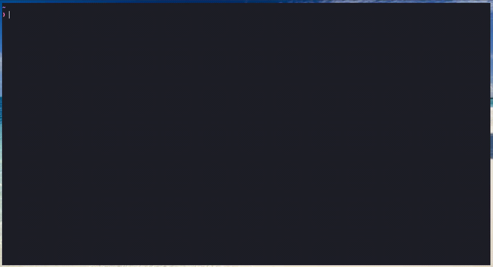
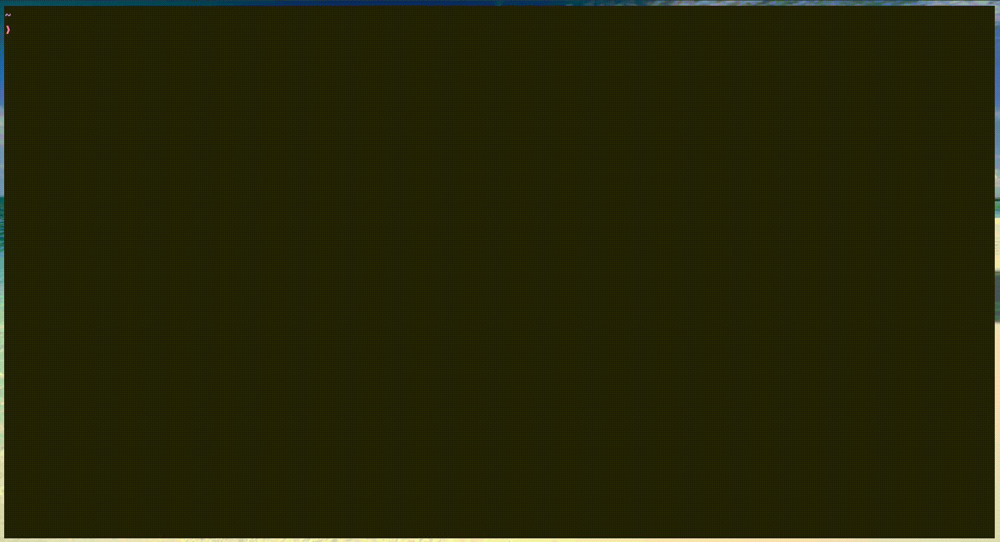

# Task Tracker



## Overview

A lightweight, reliable CLI app for managing tasks.
Built with a layered architecture, developed with TDD, and designed to produce clear, colorful terminal output.

---

## Features

* `add` — create a task (auto-increment ID, default status `todo`).
* `update` — update a task description.
* `mark-in-progress` — set task status to `in-progress`.
* `mark-done` — set task status to `done`.
* `delete` — remove a task by ID.
* `list` — list tasks (with filtering, sorting and pagination).
  * Filter by `status`, `id`, `description`, and date ranges.
  * Sort by a field and direction (e.g. `createdAt` -> `desc`).
  * Paginate using `page` and `limit` arguments.
* `help` — built-in help pages (text files in `src/docs/help/`).

---

## Key Ideas

### Layered architecture

View → Controller → DTOs/Validators → Model → Entities (clear responsibilities).

### Tests first

TDD approach, with all functionality covered by tests (achieving 100% coverage, though not enforced by CI).

### Error handling

explicit validation, helpful error messages, and edge-case handling.


### Responsive CLI UI

Custom table adapts from tiny (two-column cards) to wide terminals.


### Features

Full CRUD, `list` with filtering, sorting, and pagination, and built-in help pages.



## Quick start

**Prerequisites:** Node.js (LTS recommended)

```bash
git clone https://github.com/swe-amr-abdelaziz/task-tracker.git
cd task-tracker
```

Run the app (from anywhere):

```bash
# recommended wrapper (resolves script path)
./task-cli <command> [options]

# or directly
node main.js <command> [options]
```

---

## Commands & usage

```bash
# Add
task-cli add "Buy milk"

# Update
task-cli update 3 "Buy eggs and milk"

# Mark
task-cli mark-in-progress 3
task-cli mark-done 3

# Delete
task-cli delete 5

# List (filter / sort / paginate)
task-cli list --status=todo
task-cli list --description="meeting" --order-by=updatedAt --desc --page=1 --limit=10
```

## Flags & shorthand

Long and short forms are normalized into the same DTO before reaching the controller
(examples: `--status` / `-s`, `--page` / `-p`).


## Project Architecture

```
CLI (task-cli / main.js)
└─> Router
    └─> View (I/O + formatting)
        └─> Controller (normalize + validate + orchestrate)
            └─> DTOs / Validators
                └─> Model (in-memory + JSON persistence)
```

---

## Development notes

* Follow the layered rules: avoid calling the Model directly from View — always go through the Controller.
* Shared helpers (string builders, formatting, regex, responsive-table components) live in `src/shared`.

---

## Contributing

Small, friendly guidelines:

* Tests first. If you add or change behavior, add tests that fail, implement the code, then make them pass, then refactor.
* Keep responsibilities clear: presentation code in `view`, business logic in `controller`, persistence in `model`.
* If you add CLI flags, update `src/docs/help/<command>.txt` and add corresponding DTO.
* Run `npm test` and ensure coverage does not drop.

Open issues and PRs welcome — describe the change and include tests.

---

## Troubleshooting

* If the app can't write to the DB file, check permissions in the project directory. The model writes JSON to the configured DB path (project root by default).
* If a command throws a validation error, the CLI prints a human-friendly message (look for details in the error output).
* For help with a command: `task-cli help <command>`.

---

## License

This project is licensed under the **MIT License** — use it, improve it, and share it.
